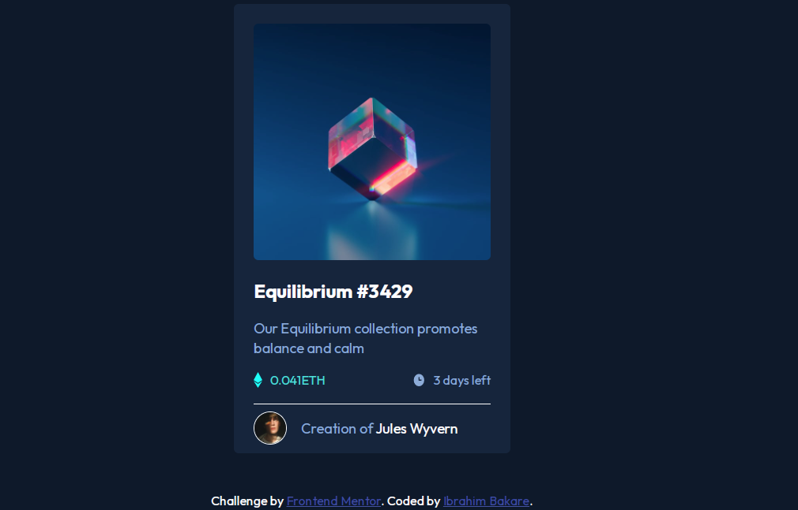

# Frontend Mentor - NFT preview card component solution

This is a solution to the [NFT preview card component challenge on Frontend Mentor](https://www.frontendmentor.io/challenges/nft-preview-card-component-SbdUL_w0U). Frontend Mentor challenges help you improve your coding skills by building realistic projects. 

## Screenshot

## Link

[Live Demo](https://nftpreview-card-component.netlify.app/)

### Built with

- Mobile-first workflow
- CSS custom properties
- Flexbox

### Useful resources

- [Google font](https://www.Googlefonts.com) - I was able to use this resources to achieve the actual font family for this project.

## Author

- Frontend Mentor - [@Brymmobaggins](https://www.frontendmentor.io/profile/Brymmobaggins)
- Twitter - [@Brymmobaggins](https://www.twitter.com/Brymmobaggins)
